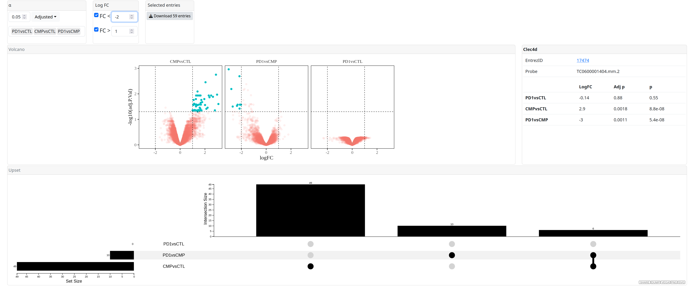

```{r, echo = FALSE}
knitr::opts_chunk$set(
    collapse = TRUE,
    comment = "#>",
    fig.path = "man/figures/"
)
```

# brightPlots




brightPlots is a package under development that contains a Shiny app to visualize the experimental results, usually from significance analisys of microarrays.

The app is composed of several [Shiny modules](https://shiny.rstudio.com/articles/modules.html) so they can be reused in different applications.

To visualize a dataset, after installing the package:

```{r, eval = FALSE}
brightPlots::app(my_dataset)
```

Usually `my_dataset` is the product of a [maUEB::toptable1](https://github.com/uebvhir/maUEB).

The app can be called with no parameters and a demo application will run.

```{r, eval = FALSE}
brightPlots::app()
```